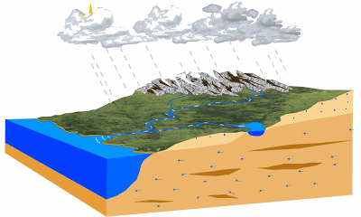
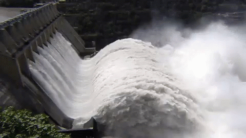
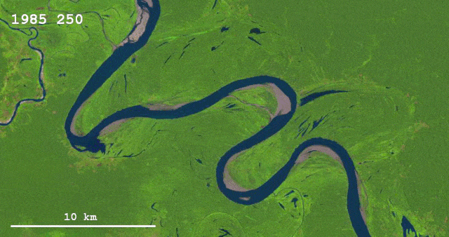
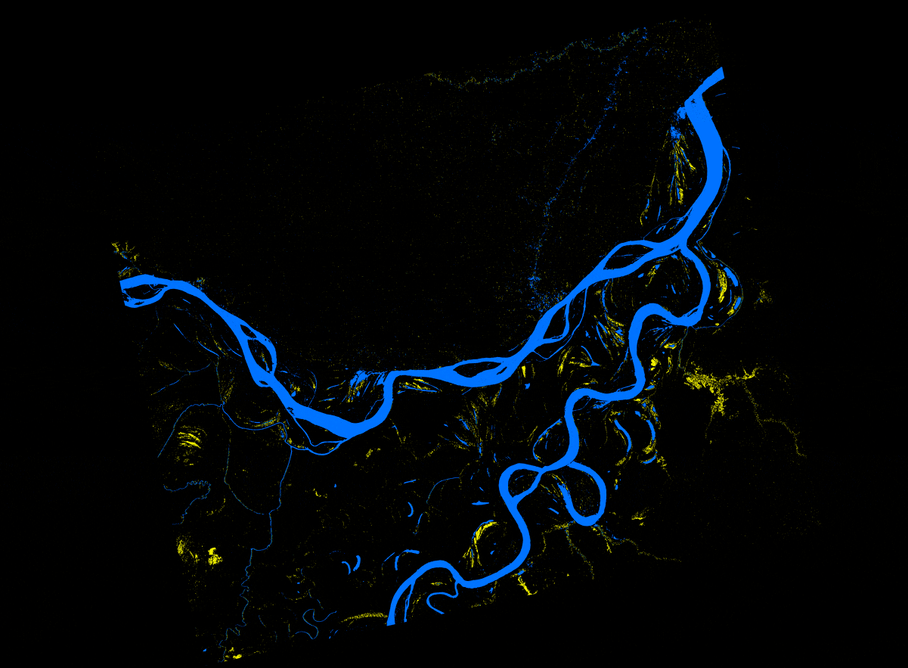

```{r child = "../setup.Rmd"}
```

```{r packages, echo=FALSE, message=FALSE, warning=FALSE}
# AGREGAR PAQUETES A UTILIZAR

```
class: center

## Acerca de mí

.left-column-image[
  
]

.left-column[
- Ingeniería ambiental / UNALM.
- Consultor del International Potato Center (CIP/CGIAR) en el área de Research Informatics Unit (RIU).
- Vicepresidente del Círculo de Investigación en Minería y Medio Ambiente (CIMMA/UNALM).
- Docente con más de 150 horas de experiencia en el dictado de cursos de Sistemas de Información Geográfica con ArcGIS, R y Python.
 ]

---

## ¿Qué es hidrología?

  

---

## Importancia de la hidrología

  

---

## Importancia de la hidrología

  

---

## Importancia de la hidrología

  

---

## Importancia de la hidrología

  

---

## Importancia de la hidrología

  

---

class: syllabus

## Contenido analítico

<b> CLASE 1 : EL CICLO HIDROLÓGICO Y LA CUENCA HIDROGRÁFICA </b>

-
-
-
-


---

## Sistema de evaluación

- Trabajos encargados  &nbsp;  &nbsp;| ??%
- Examen teórico &nbsp;  &nbsp;  &nbsp;  &nbsp;  &nbsp;  &nbsp;  &nbsp; | ??%
- Proyecto final &nbsp;  &nbsp;  &nbsp;  &nbsp;  &nbsp;  &nbsp;  &nbsp;  &nbsp;  &nbsp;| ??% 

<br/>


---

class: inverse, center, middle

# INVESTIGACIÓN REPRODUCIBLE

---

## Git y GitHub

- [Git](https://git-scm.com/) es el sistema de control de versiones más utilizado en el mundo.
- [GitHub](https://github.com/) es una plataforma para alojar proyectos Git.


---

## RMarkdown

- [RMarkdown](https://rmarkdown.rstudio.com/) integra paquetes de R y herramientas externas con la finalidad de proveer un marco de referencia para la construcción de documentación completamente reproducible.


---

class: inverse, center, middle

# GRACIAS! <br/>  <a href="mailto: marvinjqs@gmail.com">  </a> 


