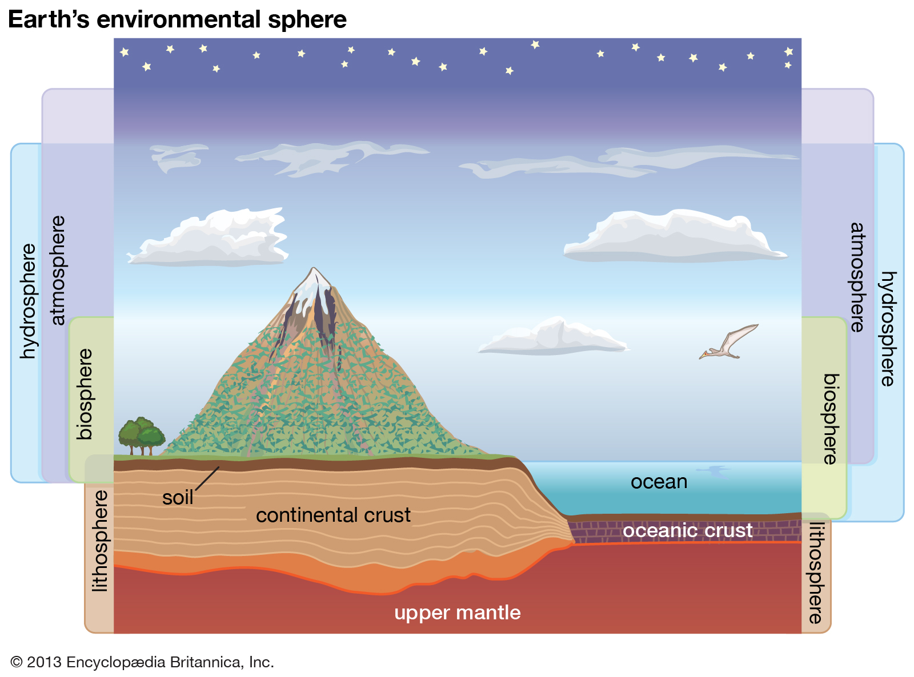
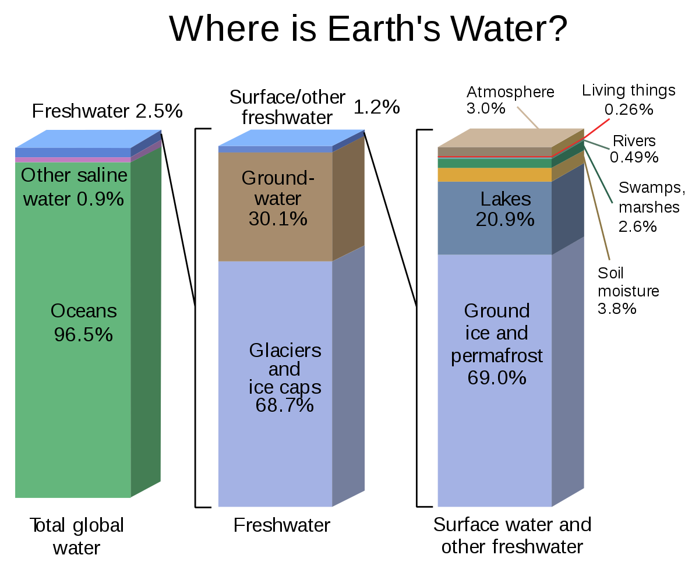
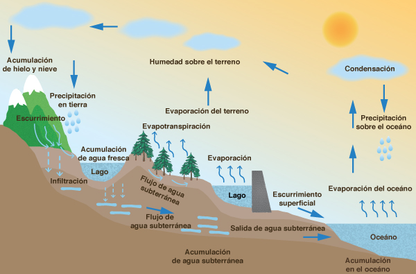
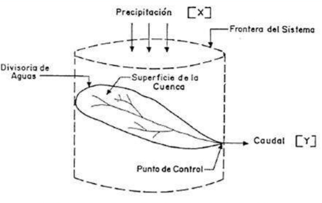

```{r child = "../setup.Rmd"}
```

```{r packages, echo=FALSE, message=FALSE, warning=FALSE}
# AGREGAR PAQUETES A UTILIZAR

```


class: inverse, center, middle

## CLASE 1 
### EL CICLO HIDROLÓGICO

---

## Breve historia 

Según Campos (1998), diversos autores reconocen 8 periodos importantes en el desarrollo histórico de los estudios sobre fenómenos hidrológicos:

- Período especulativo (?? - 1400)
- Período de observación (1400 - 1600)
- Período de medida (1600 - 1700)
- Período de experimentación (1700 - 1800)
- Período de modernización (1800 - 1900)
- Período de empirismo (1900 - 1930)
- Período de racionalización (1930 - 1950)
- Período de teorización (1950 - ¿Actualidad?)

---

## <br/>

 

---

## La hidrósfera

- Toda el agua existente en la tierra esta presente en un espacio que se denomina hidrósfera.
- La hidrósfera se extiende unos 15 km arriba de la atmósfera hasta 1 km por debajo de la litósfera o corteza terrestre.


 

---

## Distribución del agua en la tierra

 

---


## El ciclo hidrológico

- La distribución, circulación e interacción con el ambiente que tiene el agua dentro de la hidrósfera constituye el ciclo hidrológico.
- El ciclo hidrológico es el foco central de la hidrología, no tiene un principio ni fin y sus
diversos procesos ocurren en forma continua.


 

---

## El ciclo hidrológico como sistema 

- Los fenómenos hidrológicos son muy complejos y es posible que nunca se lleguen a entender en su totalidad, por ello se trata de representarlos de manera simplificada mediante modelos como un sistema.
- El ciclo hidrológico es un sistema que tiene distintos componentes, que a su vez se pueden agrupar en subsistemas más simples para ser analizados de forma separada y combinarse posteriormente.



---

class: inverse, center, middle

# GRACIAS! <br/>  <a href="mailto: marvinjqs@gmail.com">  </a> 


