```{r child = "../setup.Rmd"}
```

```{r packages, echo=FALSE, message=FALSE, warning=FALSE}
# AGREGAR PAQUETES A UTILIZAR

```


class: inverse, center, middle

## CLASE 2 
### LA CUENCA HIDROGRÁFICA

---

## Definición 

- Una cuenca es una zona de la superficie terrestre en donde (si fuera impermeable) las gotas de lluvia que caen sobre ella tienden a ser drenadas por el sistema de corrientes hacia un mismo punto de salida (Aparicio, 1989)


 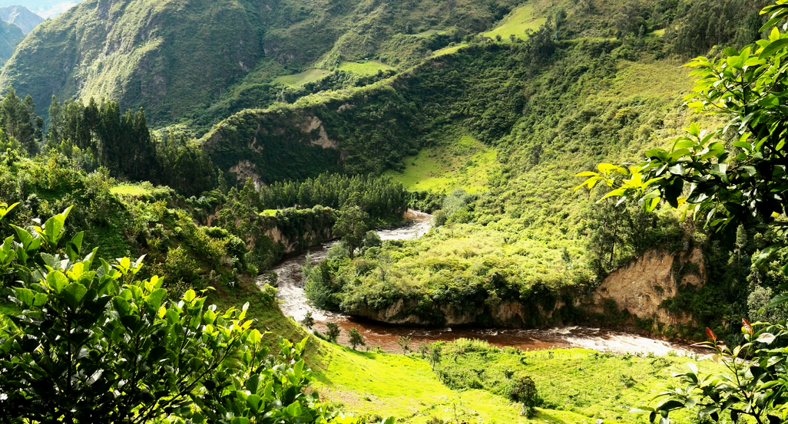
 
---

## Tipos de cuenca

- Desde el punto de vista de su salida, existen dos tipos de cuencas:


 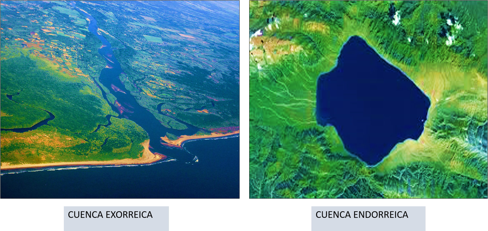


---

## Características de una cuenca

Se pueden clasificar las características de una cuenca en dos tipos:

- Las que condicionan el volumen de escurrimiento (Ejm. área)
- Las que condicionan la velocidad de respuesta (Ejm. pendiente)


 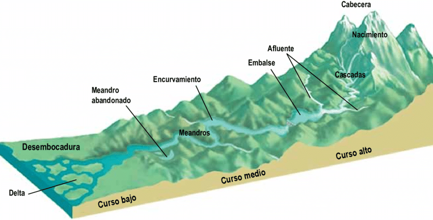
 
---

## Corriente principal y tributarios

- Es la corriente o flujo que pasa por la salida de la cuenca.
- La definición "principal" solo aplica a cuencas de tipo exorreicas.
- Todo flujo o corriente dentro de una cuenca que no sea principal.


 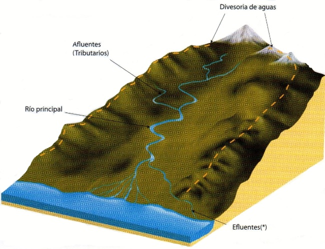
 
---

## Caracterización de cuencas

- La cuenca puede caracterizarse por su morfología, por la naturaleza del suelo y por la cobertura vegetal. Estos inciden fuertemente en la transformación de la precipitación en escorrentía.
- La relación entre las características físicas (estáticas), de la cuenca y las características hidrológicas (dinámicas), son de gran complejidad, por lo tanto, sólo es posible realizar un acercamiento a través de parámetros.


 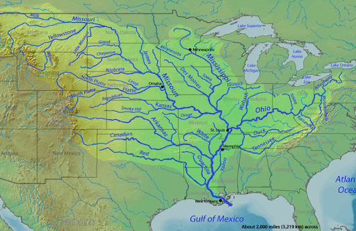


---

class: inverse, center, middle


## ANÁLISIS MORFOMÉTRICO DE LA CUENCA

---

## 1. Área 

- Es una de las características más importantes de una cuenca.
- Se encuentra delimitada por una linea imaginaria denominada divisoria de aguas o "parteaguas".
- Las proyecciones 2D modifican el tamaño original de la cuenca, dificultando algunas mediciones. Se puede calcular el área real de una cuenca conociendo su pendiente media : $A_r = A_m / cos(\alpha)$


 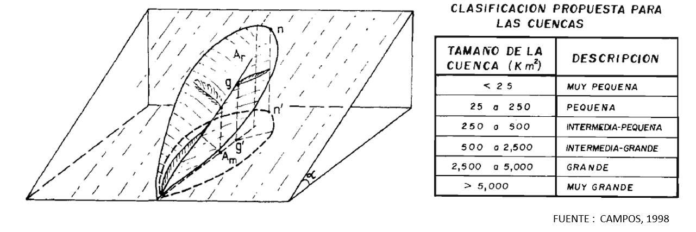


---


## 2. Perímetro

- Se define como la proyección horizontal de la divisoria de agua.


 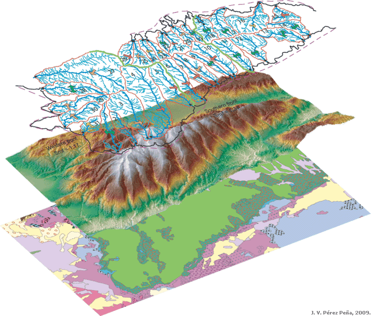

---

## 3. Forma 

- La forma de la cuenca condiciona la velocidad del escurrimiento superficial, debido a ello interviene de manera importante en las características del hidrograma de descarga.


 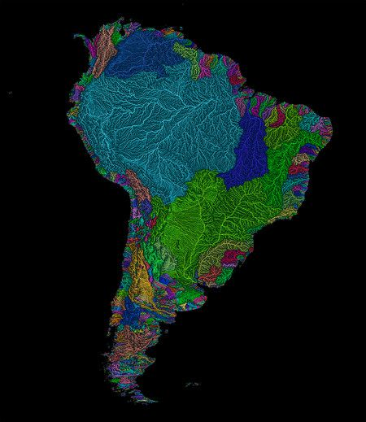
 
---

### 3.1. Coeficiente de compacidad (Kc)

- Se define como la relación adimensional entre el perímetro de la cuenca (P) y el perímetro de una circunferencia con un área igual al de la cuenca (Pc) en Km2.


$$
\begin{aligned}
K_c = \frac{P}{P_c} = \frac{0.282*P}{\sqrt[]{A}}
\end{aligned}
$$


 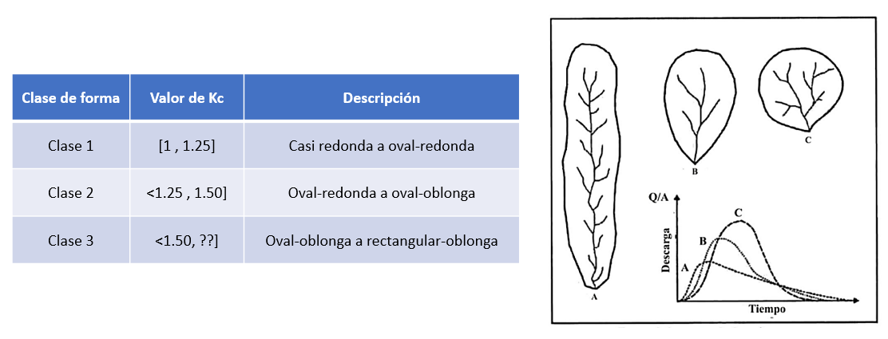

---

### 3.2. Relación de elongación (Re)

- Se define como la relación entre el diámetro de un círculo con un área igual al de la cuenca (D) y la longitud de la recta más grande trazada desde el punto de desfogue hasta la divisioria que asu vez es paralela al cauce principal (Lc) .


$$
\begin{aligned}
R_e = \frac{D}{Lc} = \frac{1.1284*\sqrt[]{A}}{L_c}
\end{aligned}
$$


 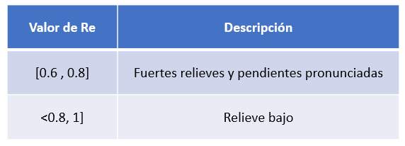


---

### 3.3. Factor de forma (Ff)

- Se define como la relación entre el ancho promedio de la cuenca (A) y Lc.


$$
\begin{aligned}
F_f = \frac{A}{L_c ^ 2}
\end{aligned}
$$


 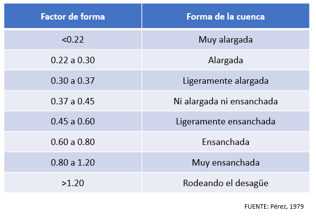


---

## 4. Curva hipsométrica 

- Se define como la representación gráfica de la relación entre la elevación y un porcentaje de la cuenca que existe por debajo o encima de una cota determinada.
- La topografía o relieve puede tener más influencia que la forma en la respuesta hidrológica de la cuenca. Por ello es común representar el relieve con la curva hipsométrica.


 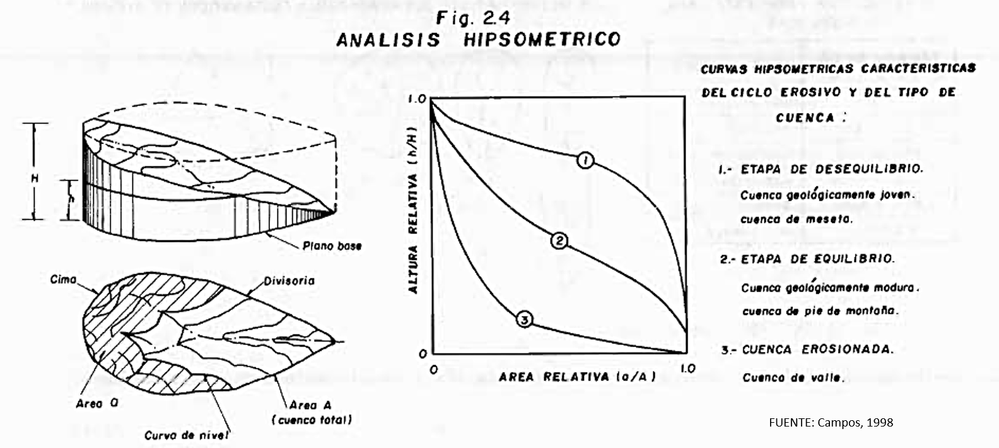


---

## 5. Elevación media (Hm)

- Tiene una gran influencia en el régimen hidrológico de la cuenca, debido a su relación con variables meteorólogicas.
- Se puede estimar a partir de la curva hipsométrica.

$$
\begin{aligned}
H_m = \frac{\sum Hi*Ai}{A_t}
\end{aligned}
$$

---

## 6. Pendiente media 

- Es importante debido a su relación entre la infiltración y la escorrentía.
- Existen diversos criterios para calcularla, siendo uno de ellos el criterio de J.W. Alvord.
- Criterio de Alvord: L = longitud total de las curvas de nivel en la cuenca, D = desnivel constante entre las curvas de nivel y A = área de la cuenca


$$
\begin{aligned}
S = \frac{D*L}{A}
\end{aligned}
$$

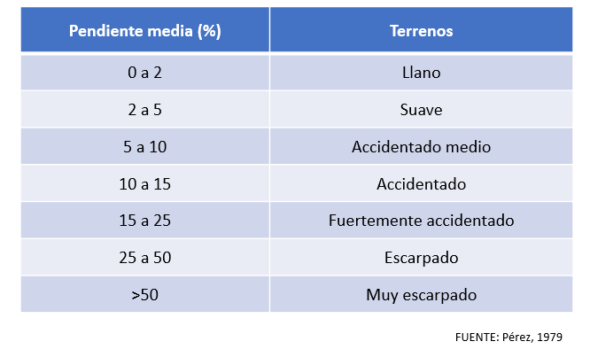

---

## 7. Red de drenaje

- Se llama red de drenaje de una cuenca, al sistema de cauces por el que fluyen los escurrimientos superficiales, subsuperficiales y subterráneos, de manera temporal o permanente (Campos, 1998).


 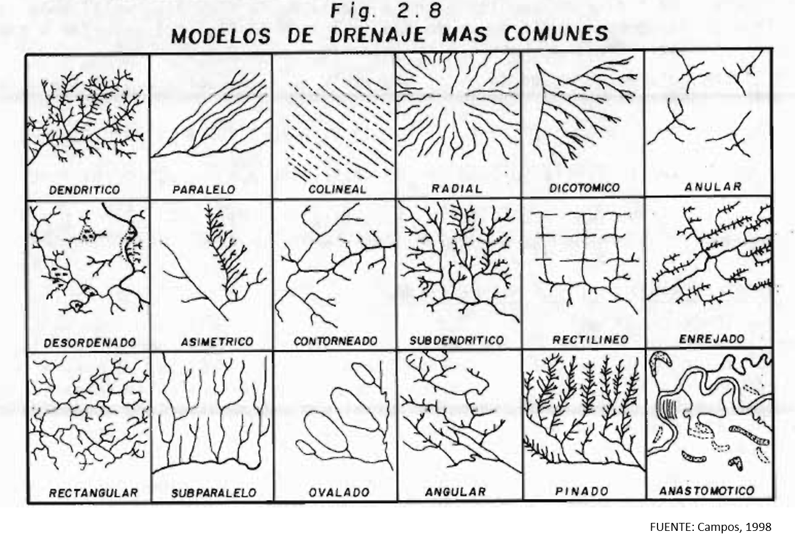
 
---


## 7.1. Tipos de corrientes

Las corrientes se clasifican en tres tipos :

- Perennes:  Conducen agua todo el tiempo excepto durante las sequías extremas.
- Intermitente: Lleva agua la mayor parte del tiempo, principalmente en épocas de lluvia.
- Efímera: Solo conduce agua durante las lluvias o inmediatamente después de éstas.

---

## 7.2. Orden de las corrientes

- El orden de las corrientes es una clasificación que refleja el grado de ramificación o bifurcación dentro de una cuenca (Campos, 1998).
- Existen diversas metodologías para determinar el orden de las corrientes, siendo las más populares las metodologías de Strahler y la de Shreve.


 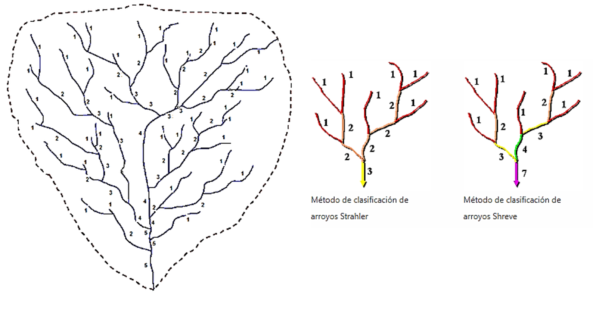

---

class: inverse, center, middle

# GRACIAS! <br/>  <a href="mailto: marvinjqs@gmail.com">  </a> 

---


